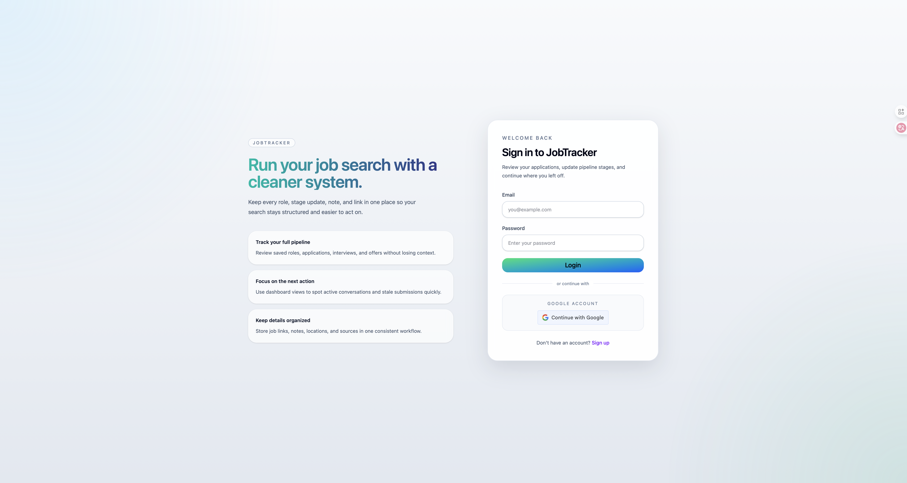
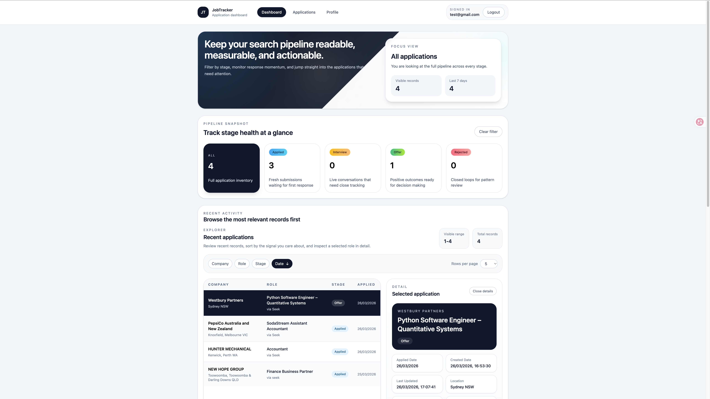
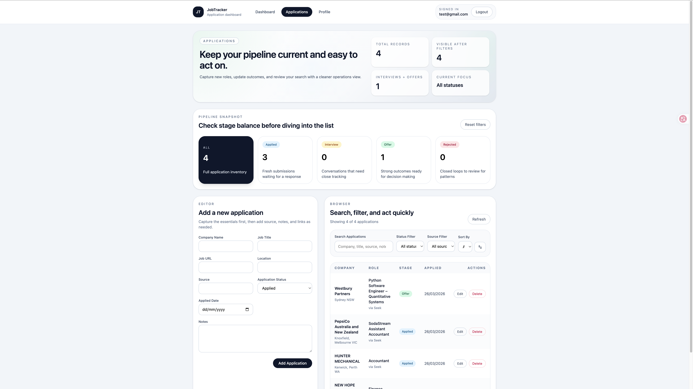
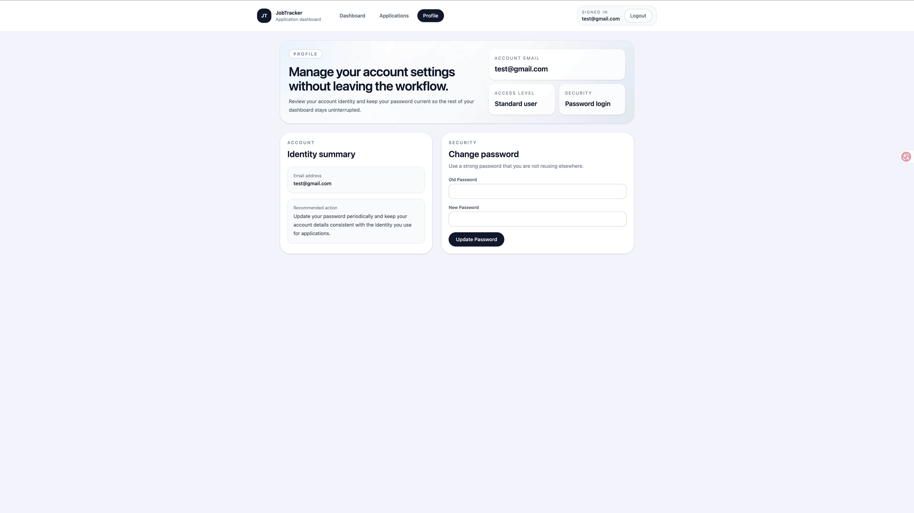

# JobTracker

JobTracker is a full-stack job application tracker built with Spring Boot and React.
It helps users capture applications, monitor pipeline health, and review progress through a cleaner dashboard workflow.

## Features

### Authentication

- Email registration and login
- Google OAuth login
- Password change for authenticated users

### Application Tracking

- Create, edit, and delete applications
- Track application progress across multiple stages
- Store source, location, notes, and job links
- Review applications from dashboard and list views

Supported statuses:

```text
SAVED
APPLIED
OA
INTERVIEW
OFFER
REJECTED
WITHDRAWN
```

Status meanings:

- `SAVED`: Role saved for later
- `APPLIED`: Submitted and waiting for first response
- `OA`: Online assessment stage
- `INTERVIEW`: Interview process in progress
- `OFFER`: Offer received
- `REJECTED`: Application closed with rejection
- `WITHDRAWN`: Application withdrawn by the user

### Dashboard

- Focus view for the current pipeline slice
- Pipeline snapshot cards for key statuses
- Recent application detail view
- Submission trend chart
- Source analysis
- Lightweight insights panel

## Screenshots

### Login



### Dashboard



### Applications



### Profile



## Tech Stack

### Frontend

- React
- TypeScript
- Vite
- Tailwind CSS

### Backend

- Spring Boot
- Spring Security
- PostgreSQL
- REST API architecture

## Project Structure

```text
jobtracker
├── src
│   └── main/java
├── jobtracker-frontend
│   └── src
├── screenshots
├── start-app.sh
├── Dockerfile
└── pom.xml
```

## Quick Start

Run backend and frontend together:

```bash
chmod +x start-app.sh
./start-app.sh
```

Default local URLs:

- Backend: `http://localhost:8080`
- Frontend: `http://localhost:5173`

## Local Setup

### Backend

Create:

```text
src/main/resources/application.properties
```

Example:

```properties
spring.datasource.url=
spring.datasource.username=
spring.datasource.password=
google.client-id=
```

Run:

```bash
./mvnw spring-boot:run
```

### Frontend

```bash
cd jobtracker-frontend
npm install
cp .env.example .env
npm run dev
```

Frontend environment variables:

```env
VITE_API_BASE_URL=http://localhost:8080/api
VITE_GOOGLE_CLIENT_ID=
```

Notes:

- `VITE_API_BASE_URL` controls which backend API the frontend talks to
- `VITE_GOOGLE_CLIENT_ID` should match the Google OAuth client configured for the backend
- Frontend routes include `/login`, `/dashboard`, `/applications`, and `/profile`

## Testing

Backend:

```bash
./mvnw test
```

Frontend:

```bash
cd jobtracker-frontend
npm test
```

## Example Use Cases

- Organize ongoing job applications in one place
- Track response progress across different stages
- Review application activity trends
- Compare which sources produce stronger outcomes

## Planned Improvements

- Resume parsing support
- Automatic source detection from job URLs
- Reminder and follow-up workflows
- Cloud deployment support

## Author👨🏻‍💻
